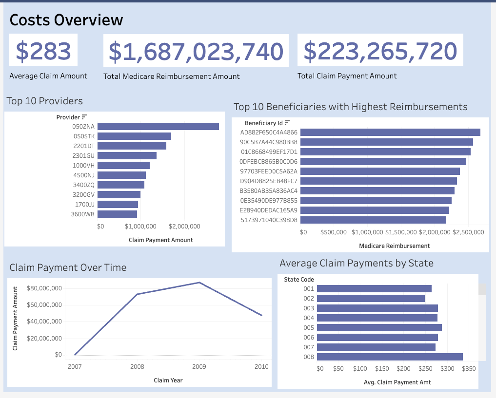
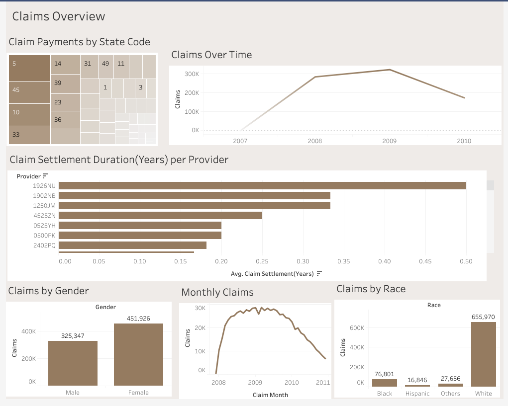

# Healthcare Claims Analysis — CMS Medicare Data

**Author:** Abhishek Potnis

---

## Project Overview

This project performs end-to-end data analysis on U.S. Medicare outpatient claims data from the **Centers for Medicare & Medicaid Services (CMS)**. The dataset covers approximately **790,000 outpatient claim records** from 2008–2010 and is joined with a beneficiary summary file containing demographics and chronic condition indicators for ~116,000 Medicare members.

The goal is to identify the key cost drivers behind chronic illness treatment — insights that are directly relevant to healthcare payers, actuaries, and population health analysts.

---

## Business Questions Answered

| # | Question |
|---|----------|
| 1 | What is the **most common chronic illness combination** among Medicare beneficiaries? |
| 2 | Which chronic illness combination incurs the **highest total cost** to Medicare? |
| 3 | Which chronic illness combination has the **highest average cost per member**? |
| 4 | Who are the **most expensive outpatient providers/vendors**? |

---

## Key Findings

- **Most common chronic condition group:** Members with multiple overlapping chronic conditions (3+) made up the largest single group in the beneficiary population.
- **Highest total cost:** The "Multiple" chronic condition group (members with 3+ conditions) drove the largest share of total Medicare outpatient spend, consistent with the compounding effect of comorbidities.
- **Highest cost per member:** Certain specific two-condition combinations (e.g., heart failure with chronic kidney disease) showed disproportionately high average claim payments per beneficiary.
- **Most expensive providers:** A small number of provider organisations accounted for a disproportionate share of total Medicare outpatient payments, highlighting concentration risk in claims spend.

---

## Project Structure

```
healthcare-project/
├── Healthcare_Project.ipynb       # Full analysis notebook (7 sections)
├── DE 1.0 Codebook.pdf            # CMS variable definitions & data dictionary
├── .gitignore                     # Excludes large raw CSVs and system files
└── README.md                      # This file
```

> **Note:** Raw input CSVs are excluded from this repo due to file size (>100 MB each). See the Data Sources section below to download them.

---

## Data Sources

All data is publicly available from the CMS Synthetic Public Use Files (SynPUFs):

| File | Description | Size | Download |
|------|-------------|------|----------|
| `DE1_0_2009_Beneficiary_Summary_File_Sample_20.csv` | Member demographics & 19 chronic condition flags (2009) | ~14 MB | [CMS Download](https://www.cms.gov/Research-Statistics-Data-and-Systems/Downloadable-Public-Use-Files/SynPUFs/Downloads/DE1_0_2009_Beneficiary_Summary_File_Sample_20.zip) |
| `DE1_0_2008_to_2010_Outpatient_Claims_Sample_20.csv` | Claim-level cost, provider, and diagnosis data (2008–2010) | ~162 MB | [CMS Download](https://www.cms.gov/Research-Statistics-Data-and-Systems/Downloadable-Public-Use-Files/SynPUFs/Downloads/DE1_0_2008_to_2010_Outpatient_Claims_Sample_20.zip) |
| `DE 1.0 Codebook.pdf` | Full variable definitions | — | Included in repo |

> Download both CSVs and place them in the project root before running the notebook.

---

## Analysis Workflow

The notebook (`Healthcare_Project.ipynb`) is structured into 7 clearly labelled sections:

| Section | Description |
|---------|-------------|
| **1. Business Problem** | Framing the analytical questions and understanding the Medicare data domain |
| **2. Data Loading** | Reading both CSVs into pandas DataFrames; selectively dropping sparse ICD-9 procedure columns |
| **3. Initial EDA** | `.head()`, `.info()`, `.describe()`, null counts, and value distributions for both datasets |
| **4. Data Cleaning & Transformation** | Column drops, renaming to snake_case, date casting, categorical encoding (sex, race, renal indicator), boolean flags for 19 chronic conditions, and creation of a composite `chronic_conditions` label |
| **5. Merging Datasets** | Left join of outpatient claims onto beneficiary data on `beneficiary_id` (~790K rows retained) |
| **6. Analysis & Summaries** | `groupby` aggregations for chronic illness prevalence, total cost, cost per member, and provider-level spend |
| **7. Export** | Merged DataFrame exported to CSV for downstream Tableau visualisation |

---

## How to Run

1. Clone this repo:
   ```bash
   git clone https://github.com/abhi0903-stack/healthcare-analysis.git
   cd healthcare-analysis
   ```

2. Install dependencies:
   ```bash
   pip install pandas numpy matplotlib seaborn jupyter
   ```

3. Download the two raw CSVs from the links above and place them in the project root.

4. Launch the notebook:
   ```bash
   jupyter notebook Healthcare_Project.ipynb
   ```
   Or open directly in **Google Colab** — update the file paths in Section 2 accordingly.

---

## Tableau Dashboards

The cleaned and merged dataset was exported to CSV and visualised in **Tableau Cloud** across two interactive dashboards.

---

### Dashboard 1 — Claims Overview



This dashboard provides a high-level operational view of outpatient claim activity across the 2008–2010 period.

| Visual | Insight |
|--------|---------|
| **Claim Payments by State Code** (treemap) | State codes 5, 45, 10, and 33 dominate claim volume, revealing geographic concentration of Medicare spend |
| **Claims Over Time** (line chart) | Claims ramped sharply from 2007, peaked at ~300K in 2009, then declined — tracking policy/coverage cycles |
| **Claim Settlement Duration per Provider** (bar chart) | Provider `1926NU` had the longest average settlement time (~0.50 years), nearly 3× the median — a flag for operational inefficiency |
| **Claims by Gender** | Female beneficiaries (451,926 claims) outpaced Male (325,347) — a ~38% higher utilisation rate |
| **Monthly Claims** (line chart) | Claims peaked mid-2009 and dropped sharply into 2010/2011, consistent with the annual trend |
| **Claims by Race** | White beneficiaries account for 655,970 claims (~85% of total); Black (76,801), Others (27,656), Hispanic (16,846) — reflects the demographic composition of the SynPUF sample |

---

### Dashboard 2 — Costs Overview



This dashboard focuses on financial metrics — reimbursement amounts, provider spend, and cost trends over time.

| Visual | Insight |
|--------|---------|
| **KPI tiles** | Total Medicare reimbursement: **$1.69B** · Total claim payment: **$223.3M** · Average claim amount: **$283** |
| **Top 10 Providers by Claim Payment** (bar chart) | Provider `0502NA` is the single highest-cost provider at ~$2M+ in total claim payments, well above the next tier |
| **Top 10 Beneficiaries by Medicare Reimbursement** | The highest-cost individual beneficiary (`AD882F650C4A4866`) received ~$2.5M in Medicare reimbursements across the period — indicating complex, high-cost care needs |
| **Claim Payment Over Time** (line chart) | Total payments peaked at ~$80M in 2009 before declining, mirroring the claims volume trend |
| **Average Claim Payments by State** (bar chart) | State code `008` has the highest average claim payment (~$340), suggesting either higher-acuity patients or higher regional pricing |

---

## Tech Stack

| Tool | Purpose |
|------|---------|
| Python 3 (pandas, numpy) | Data manipulation and aggregation |
| Matplotlib / Seaborn | Exploratory visualisation |
| Jupyter Notebook / Google Colab | Interactive analysis environment |
| Tableau Cloud | Interactive dashboard (downstream) |
| CMS SynPUF Sample 20 | Public Medicare synthetic dataset |
